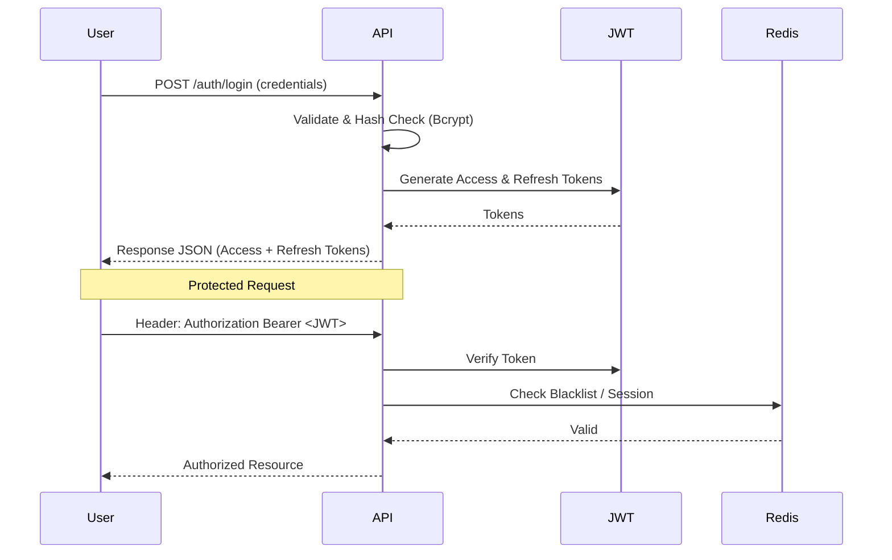

# Secure Auth CI/CD Blueprint

A professional-grade NestJS backend blueprint featuring secure authentication, Refresh Token rotation, Role-Based Access Control (RBAC), and a robust CI/CD pipeline.

## 🔐 Authentication Flow



## 🚀 Features

- **NestJS Framework**: Enterprise-grade modular architecture.
- **Passport.js & JWT**: Secure, industry-standard authentication.
- **Refresh Token Rotation**: Enhanced security for long-lived sessions.
- **RBAC (Role-Based Access Control)**: Fine-grained authorization logic.
- **Swagger Documentation**: Automated API documentation at `/api`.
- **Dockerized**: Production-ready containerization with Redis integration.
- **CI/CD**: GitHub Actions for Linting, Unit Testing, and E2E Testing.

## 🛠 Setup Guide

### Local Development
1. Clone the repository.
2. Install dependencies: `npm install`
3. Start the application: `npm run start:dev`
4. Access Swagger UI: `http://localhost:3000/api`

### Using Docker
```bash
docker-compose up --build
```

## 🏗 CI/CD Pipeline
The pipeline (`.github/workflows/ci-cd.yml`) automates:
1. **Linting**: Ensures code style adherence.
2. **Unit Tests**: Verifies business logic in isolation.
3. **E2E Tests**: Validates complete API flows.
4. **Deploy**: Mock step for production deployment.

## 🛡 Security Practices
- **Password Hashing**: Bcrypt with adaptive salt rounds.
- **Stateless Auth**: JWT-based authentication with expiration.
- **Input Validation**: Global pipes for DTO sanitization.
- **Environment Safety**: Configured for secure environment variable management.